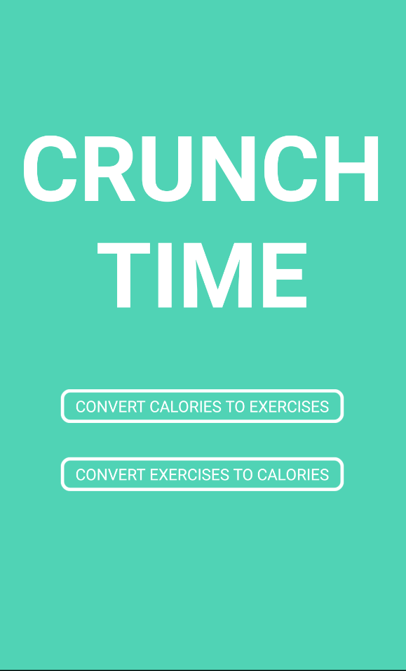
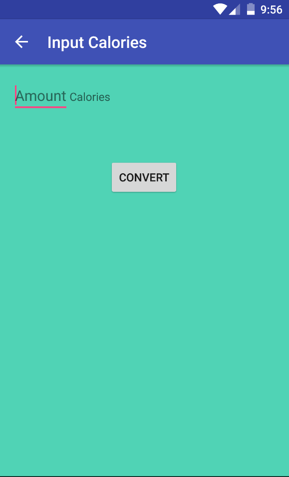
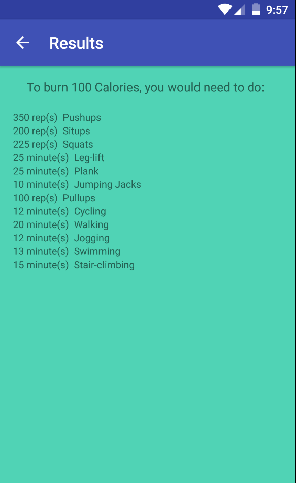
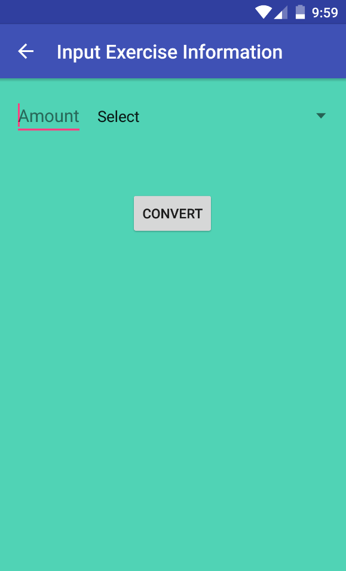
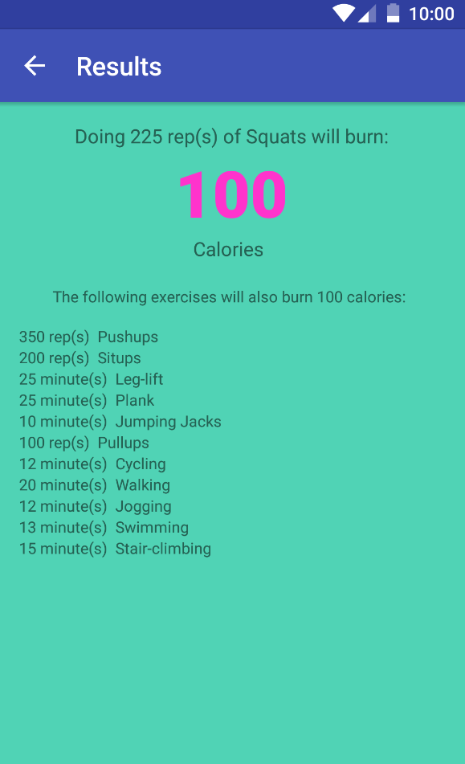

# PROG 01: Crunch Time

This app allows users to do two things. One, they can enter a number of calories and see how many reps/minutes of various exercises they would need to do to burn those calories. Also, they can enter an exercise and number of reps/minutes and see how many calories doing the exercise will burn. From there, they can also see how many reps/minutes of other exercises will burn an equivalent amount of calories.

## Authors

Sunjay Koshy ([koshy1@berkeley.edu](mailto:your_email@berkeley.edu))

## Demo Video

See [demo] (https://www.dropbox.com/s/i1e0vuntzcb2dp1/A.avi?dl=0)

## Screenshots

## Acknowledgments

* Guide on rounded buttons: [Link](http://stackoverflow.com/questions/6054562/how-to-make-the-corners-of-a-button-round)

